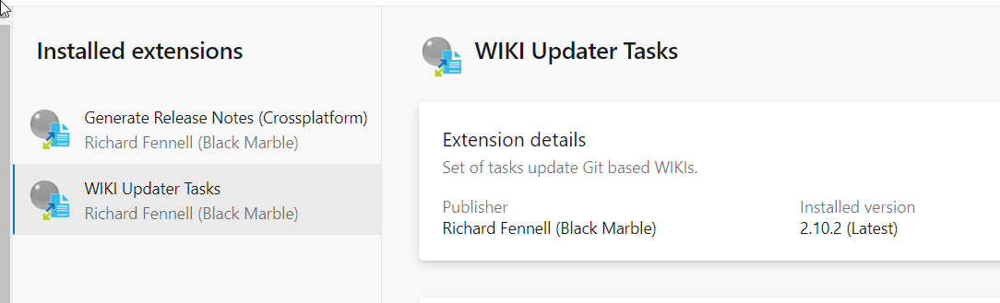
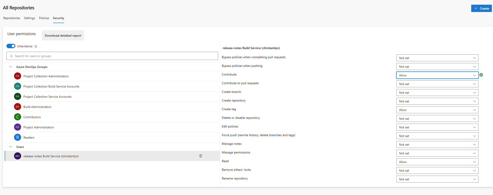
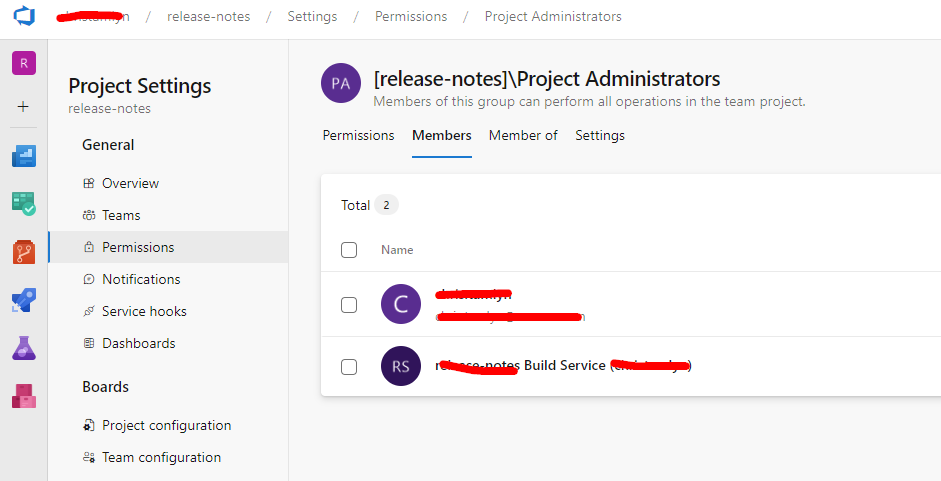
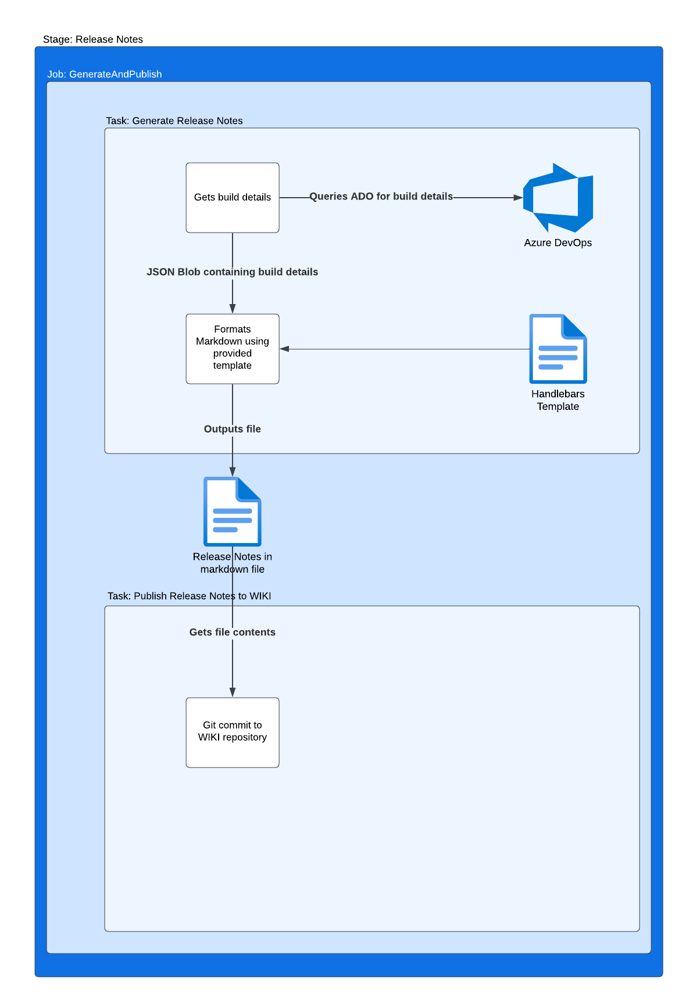
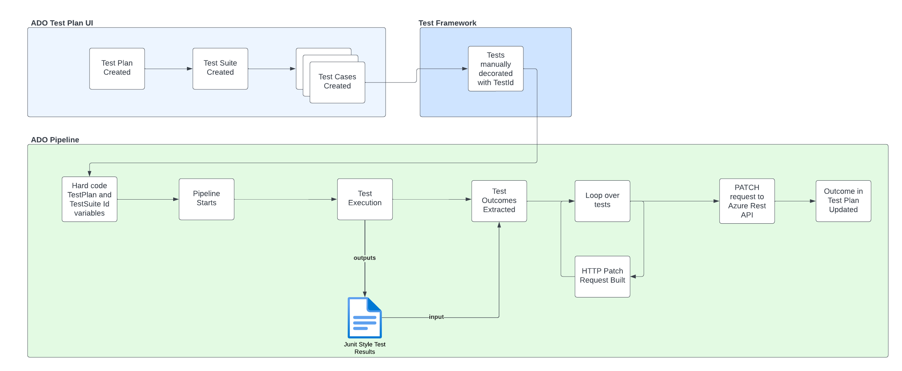

# Automated Release Notes Example

This repository shows:

- how release notes can be generated as part of an ADO Build pipeline.
- how ADO test plans can be updated using automated test results

## Setup for Automated Release Notes

To use this pipeline, the following Extensions are required in ADO:

- [WIKI Updater Tasks](https://marketplace.visualstudio.com/items?itemName=richardfennellBM.BM-VSTS-WIKIUpdater-Tasks)
- [Generate Release Notes (Crossplatform)](https://marketplace.visualstudio.com/items?itemName=richardfennellBM.BM-VSTS-XplatGenerateReleaseNotes)



The Release Notes are written to a WIKI page in the same organsation, to allow for the the Build Agents must have "Contributer" permissions



See [here](https://www.wagemakers.net/posts/automatic-devops-release-notes/) for description.

<https://www.wagemakers.net/posts/automatic-devops-release-notes/>

## Setup for Linking ADO Test Plans to Results

ADO test plans are updated using the [Azure REST Test Points API](https://learn.microsoft.com/en-us/rest/api/azure/devops/testplan/test-point/update?view=azure-devops-rest-7.1) and the default `$(System.AccessToken)`.  The build agent user must have permissions to update the Test Plan.

For simplicity setting Admin rights:

_Project Settings -> Permissions -> Project Administrators -> Members -> Add build agent user_



## Automated Release Notes



## Linking ADO Test Plans to Results

- Relies on all tests being in a single Test Plan and Test Suite
- Test manually created in ADO and assigned a TestId.  
  - TestId is not visible in the UI, only via the REST API.  Step added in pipeline to expose all test cases.
- TestId must be manually set in test to match the auto-generated value from Azure

```Javascript
test('get started link', async ({ page, setTestId }) => {
  setTestId(2)
```

- Junit output processed to determine which tests passed/failed
- Azure REST API used to update all test result statuses.  Updated in a single API request, any invalid Ids will prevent any test statuses being updated.



## Useful Links

- [Example](https://github.com/rfennell/AzurePipelines/blob/main/SampleTemplates/XplatGenerateReleaseNotes%20(Node%20based)/Version%203%20(and%20later)/date_formatter.js) templates and built in helper methods
- [Available](https://github.com/rfennell/AzurePipelines/wiki/GenerateReleaseNotes---Node-based-Cross-Platform-Task-YAML#yaml-snippet) Parameters and description.
- Blog [example](https://www.wagemakers.net/posts/automatic-devops-release-notes/).

## To Do

- Move tasks into templates or custom ADO steps
- Fix how variables are referneced in bash tasks, unsure why this is required e.g. `testPlanId: $(testPlanId)`
- Make URLs in bash scripts variables to avoid hard coding organization
- Make `testId` a configurable name in bash
