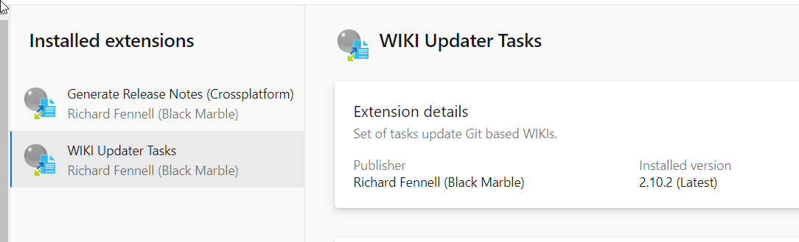
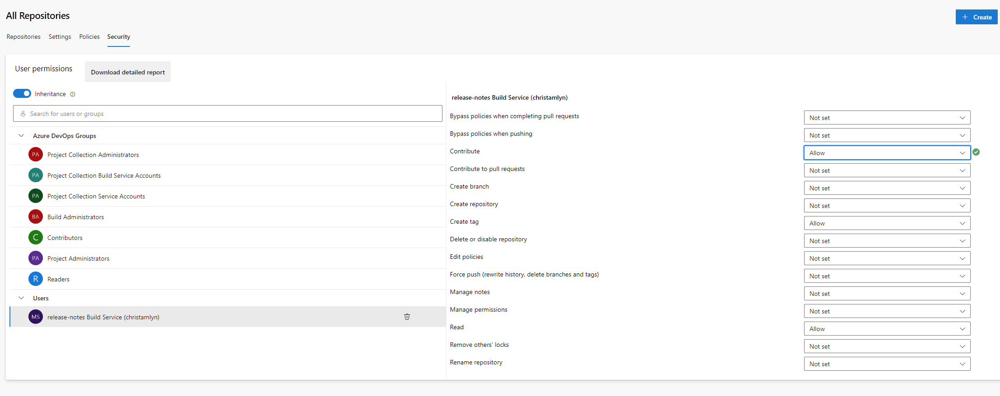

# Automated Release Notes Example

This repository shows how release notes can be generated as part of an ADO Build pipeline.

## Setup

To use this pipeline, the following Extensions are required in ADO:

- [WIKI Updater Tasks](https://marketplace.visualstudio.com/items?itemName=richardfennellBM.BM-VSTS-WIKIUpdater-Tasks)
- [Generate Release Notes (Crossplatform)](https://marketplace.visualstudio.com/items?itemName=richardfennellBM.BM-VSTS-XplatGenerateReleaseNotes)

The Release Notes are written to a WIKI page in the same organsation, to allow for the the Build Agents must have "Contributer" permissions

See [here](https://www.wagemakers.net/posts/automatic-devops-release-notes/) for description.

https://www.wagemakers.net/posts/automatic-devops-release-notes/

## Useful Links

- [Example](https://github.com/rfennell/AzurePipelines/blob/main/SampleTemplates/XplatGenerateReleaseNotes%20(Node%20based)/Version%203%20(and%20later)/date_formatter.js) templates and built in helper methods
- [Available](https://github.com/rfennell/AzurePipelines/wiki/GenerateReleaseNotes---Node-based-Cross-Platform-Task-YAML#yaml-snippet) Parameters and description.
- Blog [example](https://www.wagemakers.net/posts/automatic-devops-release-notes/).

## To Do

- Look into adding a function for custom date formatting.  [Example](https://github.com/rfennell/AzurePipelines/blob/main/SampleTemplates/XplatGenerateReleaseNotes%20(Node%20based)/Version%203%20(and%20later)/date_formatter.js).
- Investigation some formatting issues in WIKI, e.g. "None" is shown as bold.